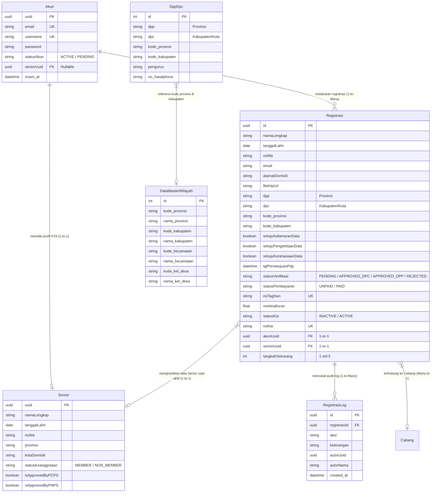

# 🗺️ ERD & Data Schema: Modul Registrasi 5 Tahapan & Master Wilayah PIKI

Dokumentasi ini berisi **Flowchart Arsitektur Sistem**, **Entity Relationship Diagram (ERD)** visual, spesifikasi struktur tabel database, dan alur relasi data untuk memudahkan tim **Frontend (FE)** dalam melakukan integrasi API.

---

## 🖼️ 1. Visual Flowchart Arsitektur Sistem & ERD Database

---

## 📊 2. ERD (Entity Relationship Diagram) Mermaid

---

## 🔗 3. Penjelasan Relasi Antar Tabel (Entity Relationships)

### A. `Akun` ⟷ `Registrasi` (1-to-Many)
- **Constraint**: `Registrasi.akunUuid` ➔ `Akun.uuid` (`@unique`).
- **Penjelasan**: Saat calon anggota mengisi Form Registrasi Tahap 1, backend **otomatis membuat record `Akun`** baru (Email & Password di-hash bcrypt). `akunUuid` pada `Registrasi` menunjuk ke akun tersebut.

### B. `Registrasi` ⟷ `RegistrasiLog` (1-to-Many)
- **Constraint**: `RegistrasiLog.registrasiId` ➔ `Registrasi.id` (`onDelete: Cascade`).
- **Penjelasan**: Setiap perubahan status (Submit Tahap 1, Verifikasi DPC, SLA Bypass ke DPP, Pembayaran Iuran, Aktivasi KTA) otomatis mencatat riwayat audit log di tabel `RegistrasiLog`.

### C. `Registrasi` ⟷ `Senior` (1-to-1)
- **Constraint**: `Registrasi.seniorUuid` ➔ `Senior.uuid` (`@unique`).
- **Penjelasan**: Ketika pendaftaran mencapai **Tahap 5 (Aktivasi KTA Digital)**, backend otomatis menerbitkan Nomor KTA dan membuat record `Senior` (Profil Keanggotaan Resmi) yang terhubung ke `Registrasi` dan `Akun`.

### D. `DppDpc` ⟷ `DataMasterWilayah` (Cascading Reference)
- **Penjelasan**: Data pengurus DPP & DPC di tabel `dpp_dpc` telah dibersihkan & dihubungkan dengan `kode_provinsi` dan `kode_kabupaten` dari tabel `data_master_wilayah`. Ini digunakan oleh API Cascading Dropdown Frontend.

---

## 📋 4. Kamus Data & Detail Field Tabel `registrasi`

| Nama Kolom | Tipe Data | Nullable? | Default | Deskripsi / Fungsi untuk Frontend |
| :--- | :--- | :--- | :--- | :--- |
| `id` | `UUID` | ❌ No | `uuid()` | Primary Key Registrasi |
| `namaLengkap` | `String` | ❌ No | - | Nama lengkap pendaftar |
| `tanggalLahir` | `Date` | ❌ No | - | Tanggal lahir pendaftar (`YYYY-MM-DD`) |
| `noWa` | `String` | ❌ No | - | Nomor WhatsApp pendaftar (harus angka) |
| `email` | `String` | ❌ No | - | Alamat email pendaftar |
| `alamatDomisili` | `String` | ❌ No | - | Alamat lengkap domisili pendaftar |
| `fileKtpUrl` | `String` | ❌ No | - | URL / Path upload foto KTP |
| `dpp` | `String` | ⭕ Yes | `null` | Nama DPP / Provinsi yang dipilih |
| `dpc` | `String` | ⭕ Yes | `null` | Nama DPC / Kabupaten/Kota yang dipilih |
| `kode_provinsi` | `String` | ⭕ Yes | `null` | Kode provinsi dari master wilayah |
| `kode_kabupaten` | `String` | ⭕ Yes | `null` | Kode kabupaten dari master wilayah |
| `setujuKebenaranData` | `Boolean` | ❌ No | `false` | Checklist Persetujuan Kebenaran Data |
| `setujuPengelolaanData` | `Boolean` | ❌ No | `false` | Checklist Persetujuan UU PDP |
| `setujuKerahasiaanData` | `Boolean` | ❌ No | `false` | Checklist Persetujuan Kerahasiaan Data |
| `tglPersetujuanPdp` | `DateTime` | ⭕ Yes | `now()` | Timestamp saat persetujuan PDP di-submit |
| `statusVerifikasi` | `String` | ❌ No | `"PENDING_VERIFIKASI_DPC"` | Status verifikasi berkas (`PENDING_VERIFIKASI_DPC`, `APPROVED_DPC`, `BYPASSED_TO_DPP`, `APPROVED_DPP`, `REJECTED`) |
| `isBypassedSla` | `Boolean` | ❌ No | `false` | Flag apakah pendaftaran kena Auto-Bypass SLA 3 hari |
| `statusPembayaran` | `String` | ❌ No | `"UNPAID"` | Status pembayaran iuran pertama (`UNPAID`, `PAID`) |
| `noTagihan` | `String` | ⭕ Yes | `null` | Nomor Invoice Tagihan Iuran |
| `nominalIuran` | `Float` | ❌ No | `50000` | Nominal iuran bulan pertama (Rp 50.000) |
| `statusKta` | `String` | ❌ No | `"INACTIVE"` | Status KTA Digital (`INACTIVE`, `ACTIVE`) |
| `noKta` | `String` | ⭕ Yes | `null` | Nomor KTA Digital resmi (`KTA-PIKI-YYYY-XXXX`) |
| `akunUuid` | `UUID` | ⭕ Yes | `null` | Foreign Key ke tabel `Akun` |
| `seniorUuid` | `UUID` | ⭕ Yes | `null` | Foreign Key ke tabel `Senior` |
| `langkahSekarang` | `Int` | ❌ No | `1` | Indikator langkah tahapan pendaftaran (1 s/d 5) |

---

## 🛠️ 5. Referensi Endpoint API untuk Tim Frontend

| Tahap | Method | Endpoint | Fungsi | Payload Utama |
| :--- | :--- | :--- | :--- | :--- |
| **Master** | `GET` | `/api/v1/master-wilayah/dpp` | Ambil daftar DPP (Provinsi) | - |
| **Master** | `GET` | `/api/v1/master-wilayah/dpc?dpp=Sumatera%20Utara` | Ambil daftar DPC berbasis DPP | Query Parameter `dpp` |
| **Tahap 1** | `POST` | `/api/v1/registrasi` | Submit Registrasi & Buat Akun | `namaLengkap`, `noWa`, `email`, `confirmEmail`, `password`, `dpp`, `dpc`, Persetujuan PDP |
| **Tahap 2/3** | `PATCH` | `/api/v1/registrasi/:id/verifikasi` | Verifikasi Berkas DPC/DPP | `status`: `"APPROVED_DPC"` / `"REJECTED"` |
| **Tahap 3** | `POST` | `/api/v1/registrasi/check-sla` | Trigger Auto-Bypass SLA 3 Hari | - |
| **Tahap 4** | `PATCH` | `/api/v1/registrasi/:id/pembayaran` | Konfirmasi Bayar Iuran | `statusPembayaran`: `"PAID"`, `buktiBayarUrl` |
| **Tahap 5** | `PATCH` | `/api/v1/registrasi/:id/aktivasi-kta` | Terbitkan & Aktifkan KTA Digital | `actorNama` |
